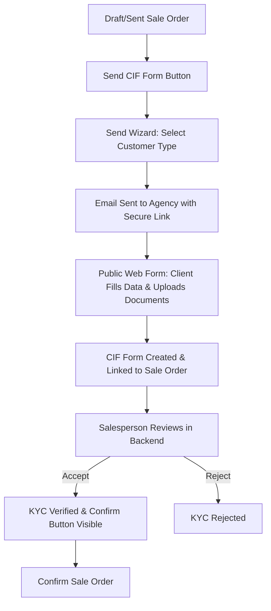

# Customer Information Form (CIF) Workflow & Mailing Setup Guide

This document describes the simplified, country-independent **Client Information Form (CIF)** workflow and provides step-by-step instructions for configuring mailing functionality in Odoo.

---

## 1. Core Workflow Overview

The CIF workflow is integrated directly with Odoo **Sale Orders** and **Contacts** (Partners) to ensure that customer KYC (Know Your Customer) information is collected, verified, and approved before a sale is finalized.

### Key Rules of the Workflow
1. **Send CIF First**: When creating a new sale, the salesperson must send the CIF form request first. The standard Odoo **Confirm** button is hidden until the customer has been verified.
2. **Confirm Button Visibility**: The custom **Confirm** button is displayed on the Sale Order *only* when the `kyc_verified` field is `True`.
3. **Automatic Sync**: 
   * When a public CIF form is submitted, it automatically links to the Sale Order and the Customer's partner record is updated with the submitted details.
   * Accepting a CIF form (`action_set_accepted`) marks the linked Sale Order's KYC status as verified (`kyc_verified = True`, `kyc_rejected = False`).
   * Rejecting a CIF form (`action_set_rejected`) marks the linked Sale Order's KYC status as rejected (`kyc_verified = False`, `kyc_rejected = True`).

---

## 2. CIF Change Request Workflow

If a customer's submitted details need correction or updating post-submission:

1. **Initiation**: The salesperson clicks **Send CIF Request** (Change Request) from the Odoo backend `cif.form` record.
2. **Secure Link Generation**: Odoo generates a secure token and sends an email containing a custom update link.
3. **Public Step-Verification**:
   * **Step 1: Email Verification**: The recipient must input their registered email address to receive a single-use Email OTP.
   * **Step 2: Security Questions**: After validating the OTP, the recipient must correctly answer the security questions configured on their profile.
   * **Step 3: Update Data**: Once verified, the recipient is granted temporary access to update their profile and supporting documents (Passport, National ID, etc.).

---

## 3. Mailing Setup Instructions

To send CIF forms and update requests successfully, both Odoo's outgoing mail servers and the specific contact records must be configured correctly.

### Step A: Configure Odoo Outgoing Mail Server
1. Log in to Odoo with **Administrator** privileges.
2. Go to **Settings** > **General Settings**.
3. Under the **Discuss** / **Email** section, activate **Custom Email Servers** and click on **Outgoing Mail Servers** (or search for `Outgoing Mail Servers` in the Settings search bar).
4. Click **New** (or **Create**) and configure your SMTP server:
   * **Description**: e.g., `SMTP Server`
   * **Connection Security**: `SSL/TLS` or `STARTTLS` (recommended)
   * **SMTP Server**: e.g., `smtp.gmail.com` or your corporate SMTP domain.
   * **SMTP Port**: `465` (for SSL) or `587` (for TLS).
   * **Username**: Your sending email address (e.g., `ce@yourcompany.com`).
   * **Password**: Your email account password or an App Password (if using 2FA like Gmail/Office365).
5. Click **Test Connection**. Ensure it returns a success message.

### Step B: Setup Agency and Agent Details on Sale Orders
The CIF wizard requires a valid Agency partner record and email to deliver the form.

1. **Mark Contacts as Agencies**:
   * Go to the **Contacts** application.
   * Open or create the contact representing the Real Estate Agency.
   * Check the **RE Agency** checkbox (visible next to the Tax ID/VAT field).
   * Enter the **Email** address (e.g., the Agency's email) and save the record.
2. **Assign the Agency to the Sale Order**:
   * Open the target **Sale Order**.
   * In the **Agency Name** field, select the newly configured Agency.
   * The associated **Agent ID** (Agent Code) and **Agency Representative** details will automatically populate.
3. **Ensure Salesperson Email**:
   * The Odoo User assigned as the Salesperson on the Sale Order must have a valid email address configured on their User profile so they can receive copy/chatter notifications when the form is submitted.

### Step C: Define base URL Parameter (For Public Links)
To ensure the public link generated in the emails uses your correct public domain name instead of `localhost`:

1. Activate **Developer Mode** in Odoo.
2. Go to **Settings** > **Technical** > **Parameters** > **System Parameters**.
3. Find the parameter key: `web.base.url`.
4. Update the value to your public domain (e.g., `https://yourcompany-cif.yourcompany.com` or your test server URL).
5. Save the parameter.
